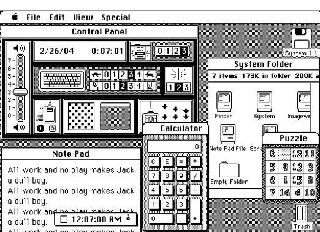
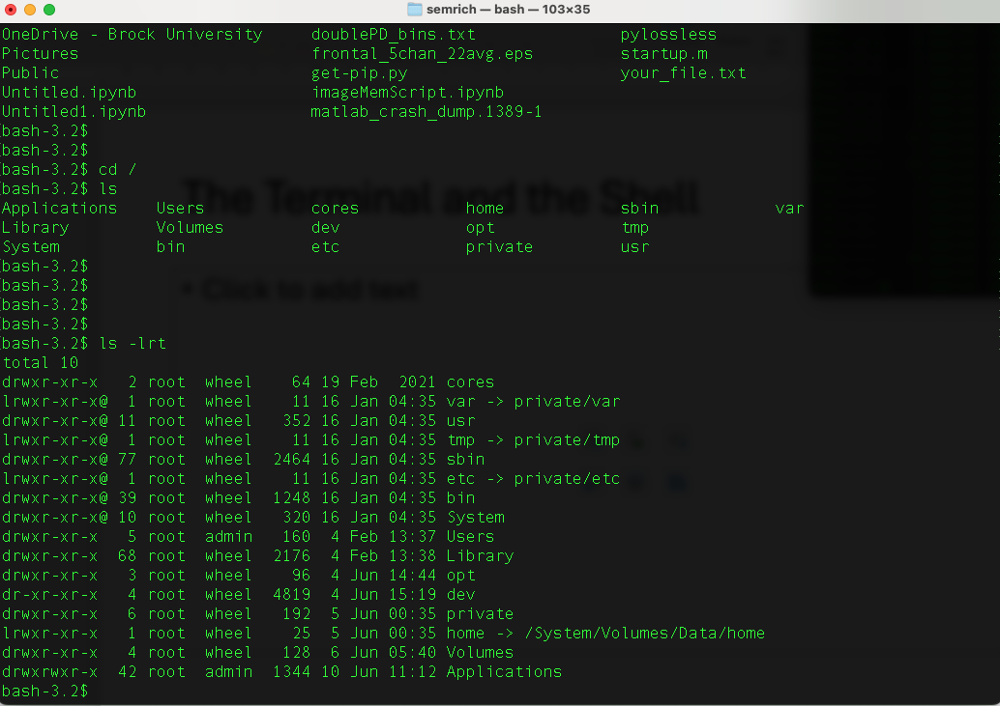
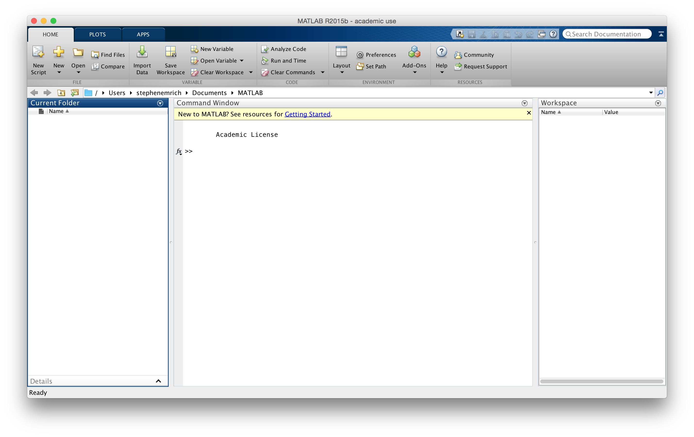
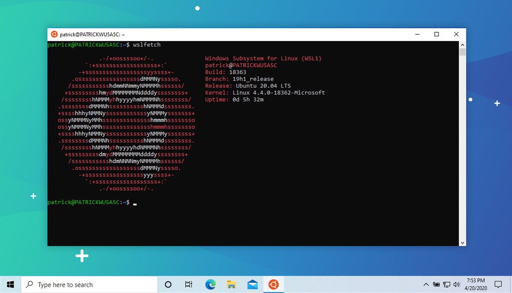

<!-- Slide number: 1 -->
# The Terminal and Shell
PSYC 5P02
Intro to Programming for Experimental Psychology
Prof. Stephen Emrich
Brock University

<!-- Slide number: 2 -->
#

<!-- Slide number: 3 -->
# The Terminal and the Shell
Every time you interact with a computer (including phone, Nintendo Switch, fridge, etc.) you are executing a series of commands

The most common method for interacting through modern applications is through the Graphical User Interface (GUI)

This typically works well for simple tasks, but can require several dozen clicks to do something (like save a file to a particular place)

Becomes even more onerous when doing things repeatedly

<!-- Slide number: 4 -->
# The Terminal and the Shell
A shell is a command line interface and scripting language that allows you to interact with the operating system of a computer
Different shell languages (e.g., bash, zsh)

Allows you to complete tasks more quickly

Allows you to automate tasks through scripting

Executed through a Terminal

<!-- Slide number: 5 -->
# Why know the terminal and the shell?
Powerful

Most programming IDEs (Integrated Development Environments) also include a terminal

Some tasks might require you execute commands through a terminal (specifically through a shell)

<!-- Slide number: 6 -->
# Getting started: Mac OSX
Mac has a native Linux-based shell that you can access through the Terminal application

Default shell is ‘zsh’.

Type ‘bash’ to change to the bash shell

<!-- Slide number: 7 -->
# Getting started: Windows
Windows default is to run Microsoft Power Terminal

For this course, use WSL 2
Emulates a UNIX/LINUX bash shell.
Can enable running of LINUX-based applications

Should also download ‘Windows Terminal’

<!-- Slide number: 8 -->
# Getting started: bash shell
The $ character is the prompt. Sometimes may have user name or other info ahead of it

NOTE: Do NOT enter the ‘$’ into the terminal ahead of commands

<!-- Slide number: 9 -->
# Getting started: bash shell
Let’s type our first command. Enter:

  		$ ls

What happens?

<!-- Slide number: 10 -->
# ls command
What is the ls command?

Every command should come with a manual that provides information about the command

To access the manual, type $ man before the name of the command:

				$ man ls

<!-- Slide number: 11 -->
# Components of a manual:

Name of command:
Usage:
Description:
List of options:
NOTE: Navigate the manual with keyboard. Press ‘q’ to quit the manual and return to the shell promptNOTE: Can sometimes also get info about the function by typing --help after the command

<!-- Slide number: 12 -->
# ls command options to note:
-a: “all” - reveals files/folders beginning with a . – aka hidden files
-G: “colorize” – prints different folders/files in different colors
-t: “time” – sort by time modified
-r: “reverse” – reverse the order of the sort:

Commands can be combined:

$ ls -lrt

NOTE:
Options are case sensitive!!!
Often options will be similar across different commands

<!-- Slide number: 13 -->

File mode
# -l ”Long format”
# of Links
Owner
Group
Size (bites)
Last modified
File

<!-- Slide number: 14 -->
# File mode:
Next nine are organized in triplets
r for ‘read’ permission
w for ‘write’ permission
x for ‘executable’ permission

Triplets are for different users:
Owner
Group
All

First character: d if directory; -

So, the following:

-rw - r --r--

Corresponds to:  file, “read and write” access for owner, read access for the group and all

<!-- Slide number: 15 -->
# A note about file naming

No “.” : Directory

Filename
.
File Format

<!-- Slide number: 16 -->
# Special characters
Different characters are reserved for different functions that can modify the commands in different ways:

/ - directory (NOTE: \ in Windows!)
$ - variable
Some characters serve as wildcards in a string (i.e., text:

* - string wildcard
? – character wildcard

Try:

$ ls *.txt

<!-- Slide number: 17 -->
# Navigating your computer
Files on your computer are stored in directories or folders

To find the current working directory use the command:

	$ pwd

Note: you can remove previous outputs to the terminal by typing $ clear

<!-- Slide number: 18 -->
# Navigating your computer
$ pwd will return something like this:

/Users/semrich

This is your current working directory
By default, can only operate on files/directories visible within this directory
Any file saved will save to this directory

Each directory/folder is separated by the / character

The highest level directory (i.e., before any other folders are defined) is called the root directory (i.e., pwd = /)

<!-- Slide number: 19 -->
# Navigating your computer
If you want do move to the root directory, you can do so with the cd command:

	$ cd /

Verify with pwd or ls

Your home directory is specified by ~/
Navigate there now and tell me what your home directory is

### Notes:

<!-- Slide number: 20 -->
# Navigating your computer
From your current working directory, you can move UP a directory (towards the root) by using

		$ cd ../

You can also specify a specific directory. E.g

		$ cd /System/Applications

./ specifies the current directory
What does $ cd ./ do?

<!-- Slide number: 21 -->
# Navigating your computer
You can navigate down into a subdirectory by just typing the name of the directory

Tip: use ‘tab’ to provide suggestions and auto-complete

Use ‘../’ to move UP a directory

Remember, when specifying a directory, ‘dir’ and ‘/dir’ are very different.

<!-- Slide number: 22 -->
# Creating directories and files
Navigate to a directory you want to use to create files in this course

Once there, we can make a new directory via:

		$ mkdir ClassFiles

Check that it exists (and its permissions) using $ ls -l

<!-- Slide number: 23 -->
# Creating directories and files
Once in there, we can make a new file with the touch command:

	$ touch tmp.txt

Again, check that it exists using $ ls –l

We can see the contents of this text editor by opening it in a text editor. There are lots of text editors you can use (Notepad, Sublime, Vscode)

Can use vi in terminal to view/edit text files:

	$ vi tmp.txt

<!-- Slide number: 24 -->
# A few rules for naming files
Don’t use spaces
Spaces are a special character used to separate arguments in the command line, so using spaces can cause issues
Don’t begin the name with a dash
Used for options
Stick with letters, numbers, ., - or _
Other characters like & and ^ can be special characters

<!-- Slide number: 25 -->
# Vi/vim
Some key commands in vi:

i – insert (begin typing)
esc – exit insert
:q – quit
:w – write (save)
:wq – write + quit

Write some text in your text file, save and exit vi

<!-- Slide number: 26 -->

https://www.splunk.com/content/dam/splunk-blogs/images/2012/08/VIM-cheatsheet1.png

<!-- Slide number: 27 -->
# Copying/(re)moving files
Let’s make a few copies of our file:

	$ cp tmp.txt tmp2.txt
	$ cp tmp.txt tmp3.txt
	$ cp tmp.txt tmpNew.txt

Now let’s make a new subdirectory called ‘replicas’

Now we can move the files with the mv command
Can delete files with the rm command

Question: how to move only those files that are copies?
Warning: rm removes files permanently!

<!-- Slide number: 28 -->
# Combining commands (piping and filtering)
We’re going to use the files in the Lesson 1 Resources directory for this part of the lesson (taken from https://swcarpentry.github.io/shell-novice)

Download the files and put them in a directory. Then, type the command :

	$wc cubane.pdb

Question:
What does this command to?
How can we apply it to all .pdb files in the directory?

<!-- Slide number: 29 -->
# Combining commands (piping and filtering)
Let’s say we only want to know the number of lines in each file, and we want to put that info in a new file lengths.txt?

	> - appends the output of a command to a new file

How would you accomplish this?

Once accomplished, verify the contents of the files with the concatenate command:

	$ cat lengths.txt

(for longer files, less command shows only a page at a time)

<!-- Slide number: 30 -->
# Combining commands (piping and filtering)
If we wanted to sort the list of files by length, we could do so with the sort command:

	$ sort –n lengths.txt

(the –n sorts by number, not alphanumerically)

If we want, we can then put this in a new file:

	$ sort –n lengths.txt > sorted-lengths.txt

>> will append outputs to an existing file

### Notes:

<!-- Slide number: 31 -->
# Combining commands (piping and filtering)
You can pass the output from one command to become the input of a second command using a pipe: |

Try to figure out what these commands are doing (be sure to be in the correct directories):

	$ sort -n lengths.txt | head -n 1

	$ wc -w *.pdb | sort -n | head -n 1

<!-- Slide number: 32 -->
# Scripting
Can write full scripts that implement loops, commands and other scripts

Not going to cover it here

May return to it after we go through loops and functions in Python

<!-- Slide number: 33 -->
# Finding things
The grep and find commands are useful ways to find files or information within files

Compare the output of cat haiku.txt to grep the haiku.txt

Exercises:
How can you make it only search for the complete word “the”
How can you make it search for a phrase such as “is not”?
How can you make it case sensitive?

<!-- Slide number: 34 -->
# Finding things
The find command finds files themselves
May need to specify the directory (cwd = .)

Try combining wildcards to find files of the same filetype (e.g., .txt)

Try it from different levels of diretories

Hint: You may need to put the wildcard in quotes

<!-- Slide number: 35 -->
# Moving files between locations
Use case for the terminal: how do I transfer hundreds of gigabytes of data between researchers at different institutions?

ssh – “secure shell”: allows you to “pipe” into the shell of another host computer

scp – “secure copy”: allows you to securely copy files between two (networked) computers

<!-- Slide number: 36 -->
# Screen
A useful command for working with remote environments is the screen command which creates a virtual terminal inside the terminal
Allows you to disconnect from the connection, while the job is still running in the background

Steps:
Create a new screen using screen
After starting your job, press CTRL + A and then D to “detach” the screen
At this point you can disconnect from the terminal and the job will continue to run on the server side
To get the screen back type screen –r on the server side.
screen –ls will provide a list of all possible screens

<!-- Slide number: 37 -->
# A note about permissions
Not all files are accessible to all users
Recall the file mode:

The chmod command plus a numberfor each of owner/group/other can changethe permissions for each file/directory

May need ”super user” access to make changes via sudo (“super-user do”)

<!-- Slide number: 38 -->
# Sudo
With great power comes great responsibility

xkcd

<!-- Slide number: 39 -->
# Sources:
https://swcarpentry.github.io/shell-novice/

https://linuxconfig.org/understanding-of-ls-command-with-a-long-listing-format-output-with-permission-bits

https://www.oreilly.com/library/view/learning-the-bash/1565923472/ch01s09.html

https://faculty.cs.niu.edu/~mcmahon/CS241/Unix_Tutorial/file_structure.html